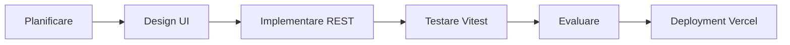
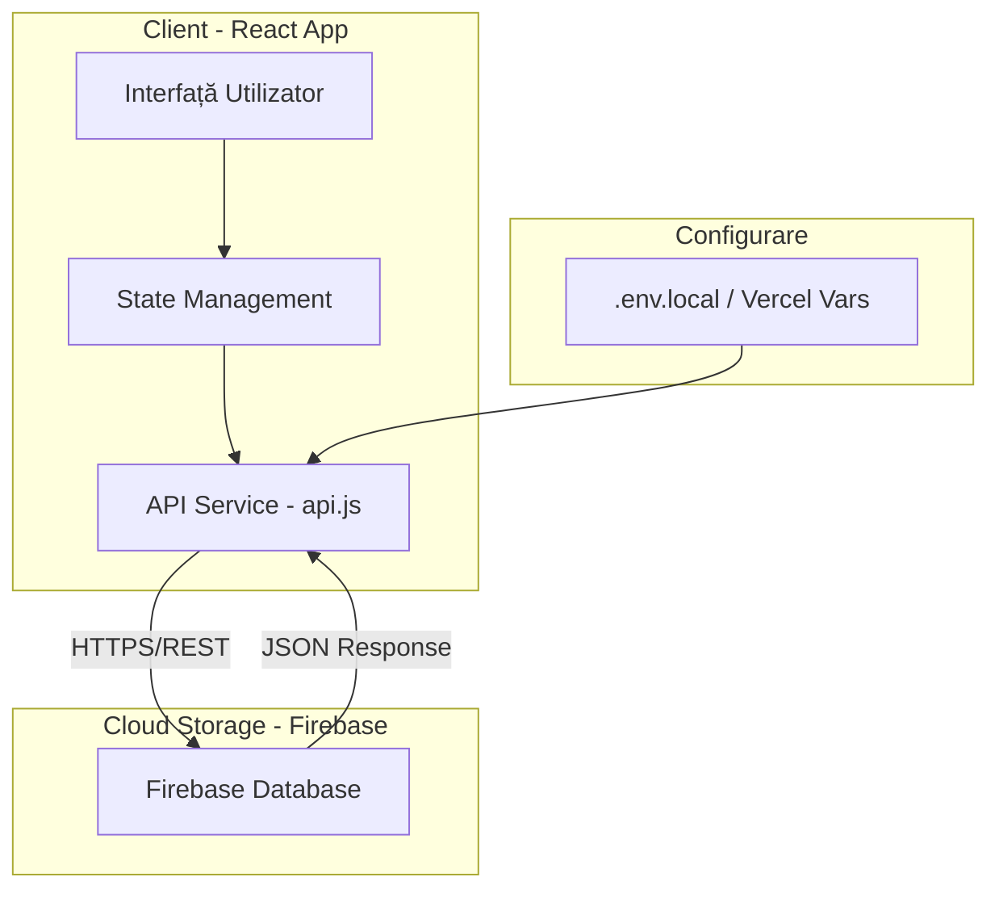
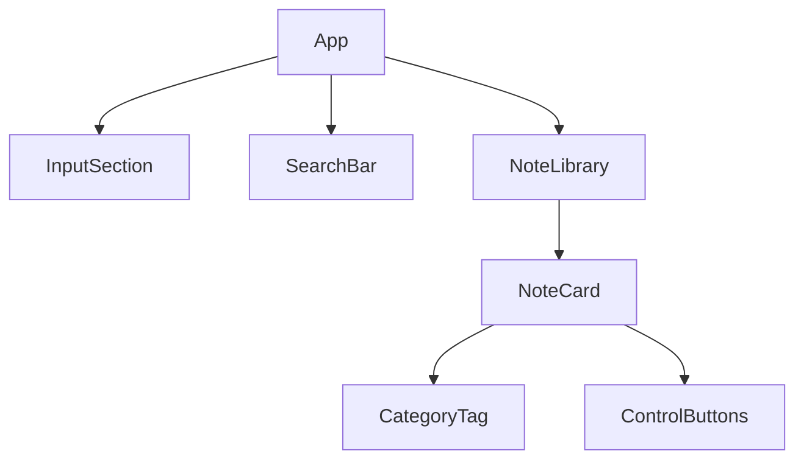

# Notes App -- Documentație Tehnică

## 1. Prezentare Generală
Aplicația **Notes App** este o platformă modernă pentru gestionarea și stocarea notițelor personale în cloud. Proiectul utilizează **React 18** pentru interfață și **Firebase Realtime Database** pentru stocarea datelor, comunicarea fiind realizată exclusiv prin **Firebase REST API**. Aplicația respectă arhitecturile web actuale de tip Single Page Application (SPA).

## 2. Obiective Tehnice
-   Arhitectură web modernă bazată pe **React 18** și **Vite**.
-   Implementarea comunicării cu baza de date folosind **REST API**(fără SDK-uri preinstalate).
-   Mecanism de **Polling** integrat pentru actualizarea automată a datelor la fiecare 30 de secunde.
-   Gestionarea configurațiilor sensibile prin variabile de mediu (`VITE_FIREBASE_URL`).

## 3. Funcționalități
-   **Gestiune Completă (CRUD)**: Utilizatorul poate adăuga, vizualiza, edita și șterge notițe în timp real.
-   **Sistem de Tag-uri**: Organizarea notițelor prin categorii (*Personal, Work, Ideas*).
-   **Căutare și Filtrare**: Bară de căutare dinamică pentru filtrarea notițelor după text sau tag.
-   **Sincronizare Automată**: Actualizare periodică a stării aplicației prin polling.
-   **Interfață Responsivă**: Layout adaptabil realizat cu CSS Grid și Flexbox.

## 4. Tehnologii Utilizate
### Frontend
-   **React 18** (Functional Components, Hooks: `useState`, `useEffect`).
-   **Vite** (Build tool de ultimă generație).
-   **CSS3** (Grid & Flexbox).
-   **Vitest** (Unit testing pentru serviciile API).

### Backend (Serverless)
-   **Firebase Realtime Database** (Stocare NoSQL tip JSON).
-   **Firebase REST API** (Comunicare securizată HTTPS).

## 5. Metodologie Agile
Proiectul a fost dezvoltat iterativ, utilizând sprint-uri pentru livrarea rapidă a funcționalităților.

### Sprint-uri
1. Configurare mediu de lucru (Vite + React) și Firebase.
2. Creare serviciu API (GET, POST, PATCH, DELETE).
3. Dezvoltare UI: Formular, Search bar și Library Grid.
4. Implementare Polling și teste unitare.
5. Documentație și Deployment final pe Vercel.

### Flux dezvoltare

## 6. Arhitectură Aplicație

## 7. Arhitectura Componentelor React

## 8. Documentație API (Firebase REST)
Aplicația interacționează cu endpoint-ul Firebase folosind sufixul `.json` obligatoriu pentru apelurile REST.

| Metodă | Endpoint | Descriere |
| :--- | :--- | :--- |
| **GET** | `/notes.json` | Preia toate notițele din bibliotecă. |
| **POST** | `/notes.json` | Salvează o notiță nouă. |
| **PATCH** | `/notes/:id.json` | Actualizează o notiță existentă (Edit). |
| **DELETE** | `/notes/:id.json` | Șterge definitiv o notiță. |

## 9. Rute și Structură Proiect

| Componentă | Fișier | Descriere |
| :--- | :--- | :--- |
| **App** | `App.jsx` | Gestionarea stării globale, a căutării și a polling-ului. |
| **API** | `api.js` | Logica de fetch (CRUD) către Firebase. |
| **Tests** | `api.test.js` | Unit testing pentru validarea răspunsurilor API. |
| **Styles** | `App.css` | Stiluri pentru grid, butoane și tag-uri. |

## 10. Concluzii
Aplicația **Notes App** demonstrează utilizarea eficientă a tehnologiilor moderne client-side și integrarea cu servicii Cloud prin protocoale REST standard. Arhitectura modulară permite scalarea ușoară și asigură o mentenanță simplă prin testare unitară și documentație clară.